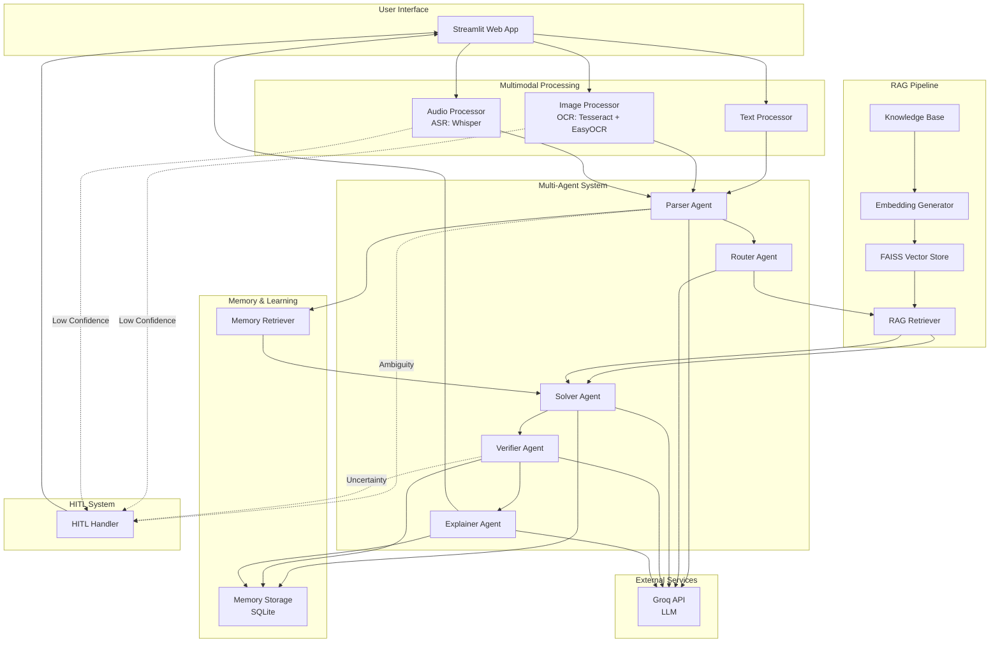

# Architecture Diagram - Multimodal Math Mentor

## System Architecture Overview

The Multimodal Math Mentor uses a multi-agent system with RAG (Retrieval-Augmented Generation), Human-in-the-Loop (HITL), and memory-based learning.

## High-Level Architecture



## Data Flow

```
Input (Image/Audio/Text)
    ↓
Multimodal Processor (OCR/ASR/Text)
    ↓ [HITL if low confidence]
Parser Agent (Structured Problem)
    ↓ [HITL if ambiguity]
Router Agent (Classification)
    ↓
RAG Retriever (Context from Knowledge Base)
    ↓
Memory Retriever (Similar Past Solutions)
    ↓
Solver Agent (Solution Generation)
    ↓
Verifier Agent (Validation)
    ↓ [HITL if uncertain]
Explainer Agent (Step-by-step Explanation)
    ↓
Memory Storage (Learning)
    ↓
User Feedback → Memory Update
```

## Component Responsibilities

### Multimodal Processing
- **Image Processor**: OCR using Tesseract + EasyOCR with confidence scoring
- **Audio Processor**: ASR using Whisper with math phrase normalization
- **Text Processor**: Text validation and cleaning

### Multi-Agent System (5 Agents)
1. **Parser Agent**: Raw input → Structured problem (topic, variables, constraints)
2. **Router Agent**: Problem classification and workflow routing
3. **Solver Agent**: Solution generation using RAG context + SymPy
4. **Verifier Agent**: Solution validation (correctness, units, constraints)
5. **Explainer Agent**: Step-by-step educational explanations

### RAG Pipeline
- **Knowledge Base**: Curated math documents (4 topics: Algebra, Probability, Calculus, Linear Algebra)
- **Embedding Generator**: Sentence-transformers (all-MiniLM-L6-v2)
- **Vector Store**: FAISS for efficient similarity search
- **Retriever**: Top-K (K=5) relevant chunks with source citations

### Memory & Learning
- **Memory Storage**: SQLite database (problems, solutions, feedback, OCR corrections)
- **Memory Retriever**: Pattern reuse from similar past solutions
- **Learning**: Applies corrections and feedback to improve accuracy

### HITL System
- **Triggers**: Low OCR/ASR confidence, parser ambiguity, verifier uncertainty
- **Workflow**: User approval/correction → system update → learning

## Technology Stack

- **Framework**: Streamlit
- **LLM**: Groq API (llama-3.1-8b-instant)
- **Embeddings**: Sentence-transformers
- **Vector DB**: FAISS
- **Storage**: SQLite
- **OCR**: Tesseract + EasyOCR
- **ASR**: Whisper
- **Math**: SymPy
- **Orchestration**: LangChain

## Key Design Patterns

1. **Multi-Agent Architecture**: Specialized agents for each task
2. **RAG Pattern**: Context-aware solutions using retrieved knowledge
3. **HITL Pattern**: Human-in-the-loop for quality assurance
4. **Memory Pattern**: Pattern reuse and learning from feedback
5. **Pipeline Pattern**: Sequential processing through agents

---

**Version**: 1.0 | **Last Updated**: 2025-01-15
